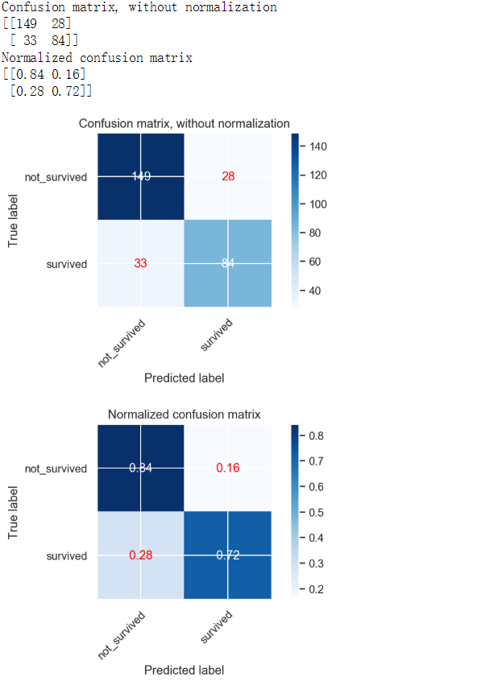
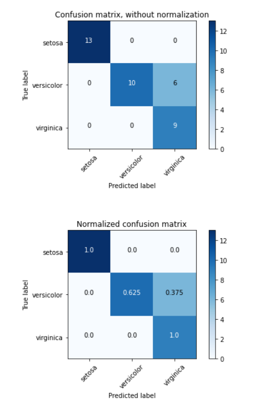

# `混淆矩阵`

混淆矩阵用法示例，用于评估数据集上分类器输出的质量。 对角线元素表示预测标签等于真实标签的点数，而非对角线元素则是分类器未正确标记的元素。 混淆矩阵的对角线值越高，表示对数越多越好。

## `一、导入相关包`

`sklearn`  中的 `confusion_matrix` 用于绘制混淆矩阵

    from sklearn.metrics import confusion_matrix

使用方法：先是真实值，再是预测值，顺序别搞反了！！！

    sklearn.metrics.confusion_matrix(y_true, y_pred, *, labels=None, sample_weight=None, normalize=None)

## `二、`混淆矩阵注意事项：

混淆矩阵方法的使用：

* 案例：

        tn, fp, fn, tp = confusion_matrix([0, 1, 0, 1], [1, 1, 1, 0]).ravel()
        (tn, fp, fn, tp)

* 输出结果：

        (0, 2, 1, 1)

__特别注意：__  confusion_matrix 生成的混淆矩阵 和 我们平时放的图是不一致的: 

* 平时放的图：

 

* 实际上混淆矩阵生成的数值：

 

* __这个一定要注意，否则你自己计算出来的 recall precision_score 还是 f1 都是错的__ 

## `三、定义绘制混淆矩阵的函数`

`案例1：`

    from sklearn.metrics import confusion_matrix

    def plot_confusion_matrix(y_true, y_pred, classes,
                            normalize=False,
                            title=None,
                            cmap=plt.cm.Blues):
        """
        This function prints and plots the confusion matrix.
        Normalization can be applied by setting `normalize=True`.
        """
        if not title:
            if normalize:
                title = 'Normalized confusion matrix'
            else:
                title = 'Confusion matrix, without normalization'

        # Compute confusion matrix
        cm = confusion_matrix(y_true, y_pred)

        # 保证我们确保只使用 y_true 和 y_pred 中的标签，因为是二分类，所以经过 unique_labels 之后就是 0和1 \
        # 然后选择出classes[[0,1]] 就是生还(survived)和未生还(not_survived)
        # 但是我目前还未发现不指定的影响
        classes = classes[unique_labels(y_true, y_pred)]

        # 对混淆矩阵进行归一化，绘制所占预测正类负类正确的比例
        if normalize:
            cm = cm.astype('float') / cm.sum(axis=1)[:, np.newaxis]
            print("Normalized confusion matrix")
        else:
            print('Confusion matrix, without normalization')

        print(cm)

        fig, ax = plt.subplots()
        # interpolation 会影响图像的显示
        # cmp Colormap实例或注册的colormap名称，用于将标量数据映射到颜色
        # https://matplotlib.org/3.1.0/api/_as_gen/matplotlib.axes.Axes.imshow.html
        im = ax.imshow(cm, interpolation='nearest', cmap=cmap)

        # 设置颜色条 就是最右边的渐变颜色条
        ax.figure.colorbar(im, ax=ax)
        # We want to show all ticks...
        ax.set(xticks=np.arange(cm.shape[1]),
            yticks=np.arange(cm.shape[0]),
            # ... and label them with the respective list entries
            xticklabels=classes, yticklabels=classes,
            title=title,
            ylabel='True label',
            xlabel='Predicted label')

        # Rotate the tick labels and set their alignment.
        # https://matplotlib.org/3.1.1/api/_as_gen/matplotlib.pyplot.setp.html
        plt.setp(ax.get_xticklabels(), rotation=45, ha="right",
                rotation_mode="anchor")

        # Loop over data dimensions and create text annotations.
        # 设置超过阈值的数值数值的颜色设置为白色，否则设置为红色
        fmt = '.2f' if normalize else 'd'
        thresh = cm.max() / 2.
        for i in range(cm.shape[0]):
            for j in range(cm.shape[1]):
                ax.text(j, i, format(cm[i, j], fmt),
                        ha="center", va="center",
                        color="white" if cm[i, j] > thresh else "red")
        fig.tight_layout()
        return ax

    # 设置np的精度
    np.set_printoptions(precision=2)

    class_names = np.array(['not_survived','survived'])

    # Plot non-normalized confusion matrix
    plot_confusion_matrix(y_test, y_pred, classes=class_names,
                        title='Confusion matrix, without normalization')

    # Plot normalized confusion matrix
    plot_confusion_matrix(y_test, y_pred, classes=class_names, normalize=True,
                        title='Normalized confusion matrix')

    plt.show()

`展示图：`

`案例2：`

    # Now plot the results of the 80%/20% split in a confusion matrix
    from sklearn.metrics import confusion_matrix
    labels = ['legit', 'malicious']
    cm = confusion_matrix(y_test, y_pred, labels)

    def plot_cm(cm, labels):
        
        # Compute percentanges
        percent = (cm*100.0)/np.array(np.matrix(cm.sum(axis=1)).T)  # Derp, I'm sure there's a better way
        
        print('Confusion Matrix Stats')
        for i, label_i in enumerate(labels):
            for j, label_j in enumerate(labels):
                print("%s/%s: %.2f%% (%d/%d)" % (label_i, label_j, (percent[i][j]), cm[i][j], cm[i].sum()))
                

                
        # Show confusion matrix
        # Thanks kermit666 from stackoverflow :)
        fig = plt.figure()
        ax = fig.add_subplot(111)
        ax.grid(b=False)
        cax = ax.matshow(percent, cmap='coolwarm')
        plt.title('Confusion matrix of the classifier')
        fig.colorbar(cax)
        ax.set_xticklabels([''] + labels)
        ax.set_yticklabels([''] + labels)
        plt.xlabel('Predicted')
        plt.ylabel('Truth')
        for i, label_i in enumerate(labels):
            for j, label_j in enumerate(labels):
                        ax.text(j, i, format(percent[i][j], fmt)+'%',
                        ha="center", va="center",
                        color="white" if cm[i, j] > thresh else "red")
                

                
        plt.show()

    plot_cm(cm, labels)

`展示图：`

`案例3：`

    import itertools
    import numpy as np
    import matplotlib.pyplot as plt

    from sklearn import svm, datasets
    from sklearn.model_selection import train_test_split
    from sklearn.metrics import confusion_matrix

    # import some data to play with
    iris = datasets.load_iris()
    X = iris.data
    y = iris.target
    class_names = iris.target_names
    print('class_names: ',class_names)

    # Split the data into a training set and a test set
    X_train, X_test, y_train, y_test = train_test_split(X, y, random_state=0)

    # Run classifier, using a model that is too regularized (C too low) to see
    # the impact on the results
    classifier = svm.SVC(kernel='linear', C=0.01)
    y_pred = classifier.fit(X_train, y_train).predict(X_test)

    def plot_confusion_matrix(cm, classes,
                                normalize=False,
                                title='Confusion matrix',
                                cmap=plt.cm.Blues):
        """
            此函数打印并绘制混淆矩阵。
            可以通过设置“ normalize = True”来应用归一化。
        """
        plt.imshow(cm, interpolation='nearest', cmap=cmap)
        plt.title(title)
        plt.colorbar()
        tick_marks = np.arange(len(classes))
        plt.xticks(tick_marks, classes, rotation=45)
        plt.yticks(tick_marks, classes)

        if normalize:
            cm = cm.astype('float') / cm.sum(axis=1)[:, np.newaxis]
            print("Normalized confusion matrix")
        else:
            print('Confusion matrix, without normalization')

        print(cm)

        thresh = cm.max() / 2.
        for i, j in itertools.product(range(cm.shape[0]), range(cm.shape[1])):
            plt.text(j, i, cm[i, j],
                        horizontalalignment="center",
                        color="white" if cm[i, j] > thresh else "black")

        plt.tight_layout()
        plt.ylabel('True label')
        plt.xlabel('Predicted label')

    # Compute confusion matrix
    cnf_matrix = confusion_matrix(y_test, y_pred)
    np.set_printoptions(precision=2)

    # Plot non-normalized confusion matrix
    plt.figure()
    plot_confusion_matrix(cnf_matrix, classes=class_names,
                            title='Confusion matrix, without normalization')

    # Plot normalized confusion matrix
    plt.figure()
    plot_confusion_matrix(cnf_matrix, classes=class_names, normalize=True,
                            title='Normalized confusion matrix')

    plt.show()

`输出结果：`

    class_names:  ['setosa' 'versicolor' 'virginica']
    Confusion matrix, without normalization
    [[13  0  0]
    [ 0 10  6]
    [ 0  0  9]]
    Normalized confusion matrix
    [[1.   0.   0.  ]
    [0.   0.62 0.38]
    [0.   0.   1.  ]]

`展示图：`

