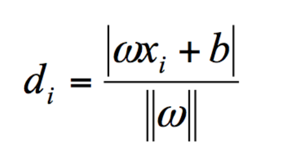
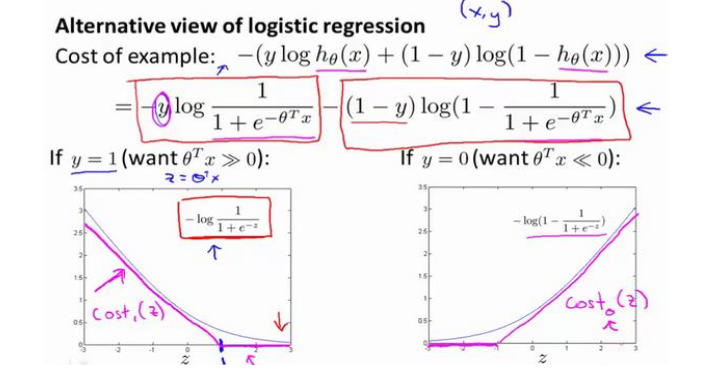
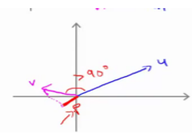
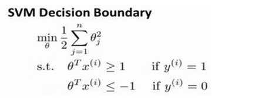
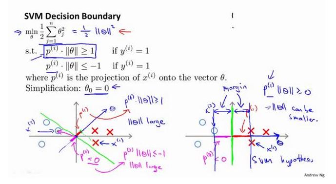
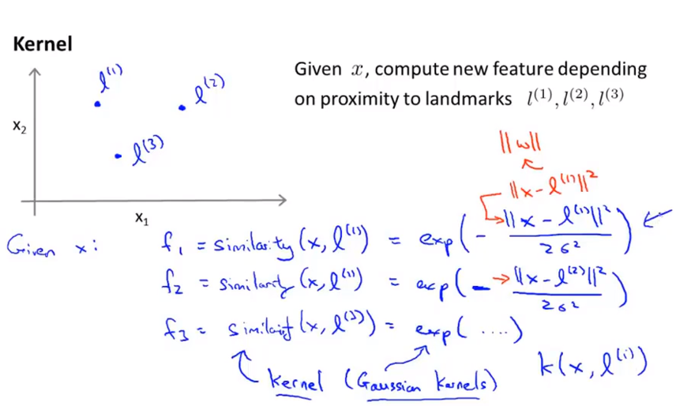
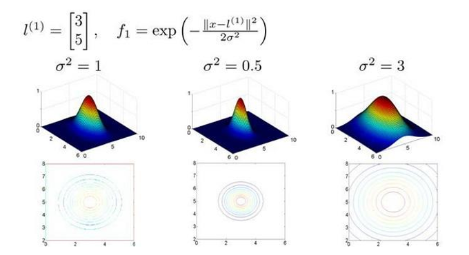

# SVM支持向量机 

`SVM 是一种二分类模型，他的基本模型是定义在特征空间上的最大间隔的线性分类器`

## `支持向量机：`
    
在一个很高维的场景中，我们很难将其可视化，在一个二维的图像上我们可以通过两个直角坐标系就可以分割出不同类别，在三维上我们可以通过平面切分不同的类别，在更高维的情况下我们很难再去切分，尤其是当这个特征本身(线性代数中的基)，如果找不到基是很难去切分这个特征的，SVM可以帮助我们去做一些基的变换，让你很好的找到一个特征空间，特征空间中的值就比较好去做切分

在一个input space(如一个平面图中)中我们很难去发现数据的规律，他可能是一个很复杂的函数，还可能存在过拟合的风险才能将两类数据分隔开，这个时候我们做一个特征变换，将其放在某一个特征空间Feature space之后，我们可以发现两个数据分割很开(我们可以通过一个很简单的平面将两类数据分割)，这样函数的复杂度也大大下降，这只是一个二分类的问题，当我们数据类型很多时SVM的效果也会更加大。

## `SVM工作原理`

在一个二维平面中，如果我们想要将蓝球和红球进行分割，我们可以使用下图中的直线B和直线A，很明显图中的直线 B 更靠近蓝色球，但是在真实环境下，球再多一些的话，蓝色球可能就被划分到了直线 B 的右侧，被认为是红色球。同样直线 A 更靠近红色球，在真实环境下，如果红色球再多一些，也可能会被误认为是蓝色球。所以相比于直线 A 和直线 B，直线 C 的划分更优，因为它的鲁棒性更强。

那怎样才能寻找到直线 C 这个更优的答案呢？这里，我们引入一个 SVM 特有的概念： __分类间隔__

实际上，我们的分类环境不是在二维平面中的，而是在多维空间中，这样直线 C 就变成了决策面 C。

在保证决策面不变，且分类不产生错误的情况下，我们可以移动决策面 C，直到产生两个极限的位置：如图中的决策面 A 和决策面 B。极限的位置是指，如果越过了这个位置，就会产生分类错误。这样的话，两个极限位置 A 和 B 之间的分界线 C 就是最优决策面。极限位置到最优决策面 C 之间的距离，就是“分类间隔”，英文叫做 margin。

如果我们转动这个最优决策面，你会发现可能存在多个最优决策面，它们都能把数据集正确分开，这些最优决策面的分类间隔可能是不同的，而那个拥有“最大间隔”（max margin）的决策面就是 SVM 要找的最优解。

__点到超平面的距离公式__:
    
在上面这个例子中，如果我们把红蓝两种颜色的球放到一个三维空间里，你发现决策面就变成了一个平面。这里我们可以用线性函数来表示，如果在一维空间里就表示一个点，在二维空间里表示一条直线，在三维空间中代表一个平面，当然空间维数还可以更多，这样我们给这个线性函数起个名称叫做“超平面”。超平面的数学表达可以写成：

`函数间隔：`

在这个公式里，w、x 是 n 维空间里的向量，其中 x 是函数变量；w 是法向量。法向量这里指的是垂直于平面的直线所表示的向量，它决定了超平面的方向。

__SVM 就是帮我们找到一个超平面__ ，这个超平面能将不同的样本划分开，同时使得样本集中的点到这个分类超平面的最小距离（即分类间隔）最大化。

在这个过程中， __支持向量__ 就是离 __分类超平面__ 最近的样本点，实际上如果确定了支持向量也就确定了这个超平面。所以支持向量决定了分类间隔到底是多少，而在最大间隔以外的样本点，其实对分类都没有意义。

所以说， SVM 就是求解最大分类间隔的过程，我们还需要对分类间隔的大小进行定义。

首先，我们定义某类样本集到超平面的距离是这个样本集合内的样本到超平面的最短距离。我们用 di 代表点 xi 到超平面 wxi+b=0 的欧氏距离。因此我们要求 di 的最小值，用它来代表这个样本到超平面的最短距离。di 可以用公式计算得出：

`几何间隔：`

其中||w||为超平面的范数（假如向量x1为[1,2] 他对应到二维坐标系中为x=1 y=2 他的向量长度就是||x|| 就是(1^2+2^2)然后开庚号，这个值就是向量x1的范数），di 的公式可以用解析几何知识进行推导，这里不做解释。

## `最大间隔的优化模型`

__我们的目标就是找出所有分类间隔中最大的那个值对应的超平面。__ 在数学上，这是一个凸优化问题（凸优化就是关于求凸集中的凸函数最小化的问题，这里不具体展开）。通过凸优化问题，最后可以求出最优的 w 和 b，也就是我们想要找的最优超平面。中间求解的过程会用到拉格朗日乘子，和 KKT（Karush-Kuhn-Tucker）条件。数学公式比较多，这里不进行展开。

## `使用 Hard - margin SVM 举例`

SVM 其实就是找一个间隔最大的线性分类器

1、`硬间隔 SVM 目标函数 和 约束（primary problem）`

2、通过 `拉格朗日函数` 转成 `对偶问题 (dual problem)`

*   `拉格朗日函数`：

    

*   `原约束问题` 其实可以表达成：

    

*   `对偶问题`：因为二次凸优化满足强对偶关系，所以 `原约束问题` 和 `对偶问题` 其实是等价的

    

3、`对偶问题` 求解，因为要最小化 w，而且又是凸优化问题，那么只需要对 min(w,b)L(w,b,α) 求偏导等于 0，得到 w* 和 一个约束：

4、然后将得到的 `w*` 和 `约束` 代入到 `拉格朗日目标函数` 得到 `min(w,b)L(w,b,α)`

5、紧接着求 `max(α) min(w,b)L(w,b,α)` 因为 `min(w,b)L(w,b,α)` 已经求出来了，现在只要求 `max(α)`，因为这个是极大值问题，我们可以通过加一个 `负号` 求他的 `最小值`, 得到 `最优参数 α`。

6、通过 KKT 条件得到参数 b* 的表达式

7、得到α*、w*、b* 后就可以得到 `sign(w*TX + b*)` SVM 硬间隔分类模型。

## `软间隔的支持向量：`

* 对于软间隔：位于间隔边界，或者位于间隔边界和分离超平面之间，或者位于分离超平面误分类一侧的向量都是支持向量。

    

        首先要明确软间隔最大化的优化目标函数中,KKT的三个条件:
        条件一： (αi*) * (yi(w.T*xi+b)+ξi-1) = 0
        条件二： (μi*) * ξi = 0
        条件三： C - αi - μi = 0

        由此可知：
        　　当 αi* = 0时，KKT条件一显然成立，根据条件三得 μi* = C ,而为了使KKT条件二要成立，则松弛变量ξi=0，三个条件都成立，说明样本点正确分类，正确分类就说明 yi(w.T*xi+b)+0-1>=0 , 也就是说样本点要么在间隔边界上，要么在远离间隔边界的地方;

        　　当 0 < αi* < C 时，由条件三可知 0 < μi* < C ，而条件二要成立，则 ξi = 0，此时为了满足条件一，可知yi(w.T*xi+b)+ξi-1 = 0必须成立，前面说了ξi = 0，则 yi(w.T*xi+b) - 1 = 0 必须成立，说明样本点必在间隔边界上;

        　　当 αi* = C 时，由条件三知，μi* = 0，进而得出条件二恒成立，ξi的取值不固定，但是它的基本约束条件为ξi>=0，于是分情况讨论:
        　　(a) 0 <= ξi < 1 时
        　　为了使条件一成立，则yi(w.T*xi+b)+ξi-1 = 0，即 0 < yi(w.T*xi+b) <= 1，说明样本点在间隔边界和分类超平面之间
        　　(b) ξi = 1 时
        　　为了使条件一成立，则yi(w.T*xi+b)+ξi-1 = 0，即 yi(w.T*xi+b) = 0 ，说明样本点在分类超平面上
        　　(c) ξi > 1 时
        　　为了使条件一成立，则yi(w.T*xi+b)+ξi-1 = 0，即 yi(w.T*xi+b) < 0 ，说明样本点在分类超平面的另一侧，为误分类点

<!-- 

 -->

## `硬间隔、软间隔和非线性 SVM`

假如数据是完全的线性可分的，那么学习到的模型可以称为硬间隔支持向量机。换个说法，硬间隔指的就是完全分类准确，不能存在分类错误的情况。软间隔，就是允许一定量的样本分类错误,但是，实际工作中的数据没有那么“干净”，或多或少都会存在一些噪点。所以线性可分是个理想情况。这时，我们需要使用到软间隔 SVM（近似线性可分），比如下面这种情况：

__另外还存在一种情况，就是非线性支持向量机。__

比如下面的样本集就是个非线性的数据。图中的两类数据，分别分布为两个圆圈的形状。那么这种情况下，不论是多高级的分类器，只要映射函数是线性的，就没法处理，SVM 也处理不了。这时，我们需要引入一个新的概念： __核函数。 它可以将样本从原始空间映射到一个更高维的特质空间中，使得样本在新的空间中线性可分。这样我们就可以使用原来的推导来进行计算，只是所有的推导是在新的空间，而不是在原来的空间中进行。__

所以在非线性 SVM 中，核函数的选择就是影响 SVM 最大的变量。最常用的核函数有线性核、多项式核、高斯核、拉普拉斯核、sigmoid 核，或者是这些核函数的组合。这些函数的区别在于映射方式的不同。通过这些核函数，我们就可以把样本空间投射到新的高维空间中。 __其中线性核和高斯核最为常见。__

## 用 SVM 如何解决多分类问题

SVM 本身是一个二值分类器，最初是为二分类问题设计的，也就是回答 Yes 或者是 No。而实际上我们要解决的问题，可能是多分类的情况，比如对文本进行分类，或者对图像进行识别。

针对这种情况，我们可以将多个二分类器组合起来形成一个多分类器，常见的方法有 __“一对多法”__和 __“一对一法”__ 两种。

__1、 一对多法:__

假设我们要把物体分成 A、B、C、D 四种分类，那么我们可以先把其中的一类作为分类 1，其他类统一归为分类 2。这样我们可以构造 4 种 SVM，分别为以下的情况：

    （1）样本 A 作为正集，B，C，D 作为负集；
    （2）样本 B 作为正集，A，C，D 作为负集；
    （3）样本 C 作为正集，A，B，D 作为负集；
    （4）样本 D 作为正集，A，B，C 作为负集。

这种方法，针对 K 个分类，需要训练 K 个分类器，分类速度较快，但训练速度较慢，因为每个分类器都需要对全部样本进行训练，而且负样本数量远大于正样本数量，会造成样本不对称的情况，而且当增加新的分类，比如第 K+1 类时，需要重新对分类器进行构造。

__2、 一对一法:__

一对一法的初衷是想在训练的时候更加灵活。我们可以在任意两类样本之间构造一个 SVM，这样针对 K 类的样本，就会有 C(k,2) 类分类器。
比如我们想要划分 A、B、C 三个类，可以构造 3 个分类器：  

    （1）分类器 1：A、B；
    （2）分类器 2：A、C；
    （3）分类器 3：B、C。

当对一个未知样本进行分类时，每一个分类器都会有一个分类结果，即为 1 票，最终得票最多的类别就是整个未知样本的类别。

__多分类问题小结:__
              
   __优势：__ 一对一法这样做的好处是，如果新增一类，不需要重新训练所有的 SVM，只需要训练和新增这一类样本的分类器。而且这种方式在训练单个 SVM 模型的时候，训练速度快。
                  
   __不足：__ 但这种方法的不足在于，分类器的个数与 K 的平方成正比，所以当 K 较大时，训练和测试的时间会比较慢。

## `代价函数`

`Logistic regression 代价函数：`

`SVM 代价函数：`

`SVM 的代价函数和逻辑回归的较为相似，但是其中有一些不同：`

`首先，我们要除去1/𝑚这一项:`
            
__首先在SVM代价函数中省去了1/m 因为将目标函数乘以一个常量，并不会改变最小值θ。__ 这仅仅是由于人们使用支持向量机时，对比于逻辑回归而言，不同的习惯所致，但这里我所说的意思是：你知道，我将要做的是仅仅除去1/𝑚这一项，但是，这也会得出同样的 𝜃 最优值，好的，因为1/𝑚 仅是个常量，因此，你知道在这个最小化问题中，无论前面是否有1/𝑚 这一项，最终我所得到的最优值𝜃都是一样的。
        
这里我的意思是，先给你举一个实例，假定有一最小化问题：即要求当(𝑢 − 5)2 + 1取得最小值时的𝑢值，这时最小值为：当𝑢 = 5时取得最小值。 
        
现在，如果我们想要将这个目标函数乘上常数 10，这里我的最小化问题就变成了：求使得10 × (𝑢 − 5)2 + 10最小的值𝑢，然而，使得这里最小的𝑢值仍为 5。因此将一些常数乘以你的最小化项，这并不会改变最小化该方程时得到𝑢值。因此，这里我所做的是删去常量𝑚。也相同的，我将目标函数乘上一个常量𝑚，并不会改变取得最小值时的𝜃值
        
`第二点概念上的变化，我们只是指在使用支持向量机时，一些如下的标准惯例，而不是逻辑回归：`
        
因此，对于逻辑回归，在目标函数中，我们有两项： `第一个是训练样本的代价`。`第二个是我们的正则化项，我们不得不去用这一项来平衡`。 这就相当于我们想要最小化𝐴加上正则化参数𝜆，然后乘以其他项𝐵对吧？这里的𝐴表示这里的第一项，同时我用 B 表示第二 项，但不包括𝜆，我们不是优化这里的𝐴 + 𝜆 × 𝐵。我们所做的是通过设置不同正则参数𝜆达到优化目的。这样，我们就能够权衡对应的项，是使得训练样本拟合的更好。即最小化𝐴。还是保证正则参数足够小，也即是对于 B 项而言，但对于支持向量机，按照惯例，我们将使用一个不同的参数替换这里使用的𝜆来权衡这两项。你知道，就是第一项和第二项我们依照惯例使用一个不同的参数称为𝐶，同时改为优化目标，𝐶 × 𝐴 + 𝐵因此，在逻辑回归中，如果给定𝜆，一个非常大的值，意味着给予 B 更大的权重。而这里，就对应于将𝐶 设定为非常小的值，那么，相应的将会给𝐵比给𝐴更大的权重。因此，这只是一种不同的方式来控制这种权衡或者一种不同的方法，即用参数来决定是更关心第一项的优化，还是更关心第二项的优化。当然你也可以把这里的参数𝐶 考虑成1/𝜆，同 1/𝜆所扮演的角色相同，并且这两个方程或这两个表达式并不相同，因为𝐶 = 1/𝜆，但是也并不全是这样，如果当𝐶 = 1/𝜆时，这两个优化目标应当得到相同的值，相同的最优值 𝜃。 __因此，就用它们来代替。那么，我现在删掉这里的𝜆，并且用常数𝐶来代替。因此，这就得到了在支持向量机中我们的整个优化目标函数。然后最小化这个目标函数，得到 SVM 学习到的参数𝐶。__
  
`最后 逻辑回归输出的是概率，SVM输出的是直接值：`  
       
最后有别于逻辑回归输出的概率。 __在这里，我们的代价函数，当最小化代价函数，获得参数𝜃时，支持向量机所做的是它来直接预测𝑦的值等于 1，还是等于 0。__ 因此，这个假设函数会预测 1。当𝜃𝑇𝑥大于或者等于 0 时，或者等于 0 时，所以学习参数𝜃就是支持向量机假设函数的形式。那么，这就是支持向量机数学上的定义。

## 补充

因为和逻辑回归的较为相似，我们先仿照着逻辑回归话一下SVM的代价函数图：

曲线是逻辑回归的代价函数图，紫色的线是SVM的代价函数图。同时 用 𝑧 表示𝜃𝑇𝑥，即： 𝑧 = 𝜃𝑇𝑥。如果画出关于𝑧 的函数，你会看到图的这条曲线，我们同样可以看到，当𝑧 增大时，也就是相当于𝜃𝑇𝑥增大时，𝑧 对应的值会变的非常小。对整个代价函数而言，影响也非常小。这也就解释了，为什么逻辑回归在观察到正样本𝑦 = 1时，试图将𝜃𝑇𝑥设置得非常大。因为，在代价函数中的这一项会变的非常小。 

这是我的支持向量机模型的代价函数，在左边这里我画出了关于𝑧的代价函数cos𝑡1(𝑧)，此函数用于正样本，而在右边这里我画出了关于𝑧的代价函数cos𝑡0(𝑧)，横轴表示𝑧，现在让我们考虑一下，最小化这些代价函数的必要条件是什么。如果你有一个正样本，𝑦 = 1，则只有在𝑧 >= 1时，代价函数cos𝑡1(𝑧)才等于 0。 
      
换句话说，如果你有一个正样本，我们会希望𝜃𝑇𝑥>=1，反之，如果𝑦 = 0，我们观察一下，函数cos𝑡0(𝑧)，它只有在𝑧 <= −1的区间里函数值为 0。这是支持向量机的一个有趣性质。 __事实上，如果你有一个正样本𝑦 = 1，则其实我们仅仅要求𝜃𝑇𝑥大于等于 0，就能将该样本恰当分出，（极限位置）__ 这是因为如果𝜃𝑇𝑥>0 大的话，我们的模型代价函数值为 0，类似地，如果你有一个负样本，则仅需要𝜃𝑇𝑥<=0 就会将负例正确分离， __但是，支持向量机的要求更高，不仅仅要能正确分开输入的样本，即不仅仅要求𝜃𝑇𝑥>0，我们需要的是比 0 值大很多，比如大于等于 1，我也想这个比 0 小很多，比如我希望它小于等于-1，这就相当于在支持向量机中嵌入了一个额外的安全因子，或者说安全的间距因子。__

__为什么SVM总能求得分类间隔中最大的那个值对应的超平面？__

涉及到向量内积：
    
 
 
 假设我有两个向量，𝑢和𝑣，我将它们写在这里。两个都是二维向量，我们看一下，𝑢𝑇𝑣（u的转置乘以v）的结果。𝑢𝑇𝑣也叫做向量𝑢和𝑣之间的内积。由于是二维向量，我可以将它们画在这个图上。我们说，这就是向量𝑢即在横轴上，取值为某个𝑢1，而在纵轴上，高度是某个𝑢2作为𝑢的第二个分量。现在，很容易计算的一个量就是向量𝑢的范数。∥𝑢∥表示𝑢的范数，即𝑢的长度，即向量𝑢的欧几里得长度。根据毕达哥拉斯定理，，这是向量𝑢的长度，它是一个实数。现在你知道了这个的长度是多少了。我刚刚画的这个向量的长度就知道了。

现在让我们回头来看向量𝑣 ，因为我们想计算内积。𝑣是另一个向量，它的两个分量𝑣1和𝑣2是已知的。向量𝑣可以画在这里，现在让我们来看看如何计算𝑢和𝑣之间的内积。这就是具体做法，我们将向量𝑣投影到向量𝑢上，我们做一个直角投影，或者说一个 90 度投影将其投影到𝑢上，接下来我度量这条红线的长度。我称这条红线的长度为𝑝，因此𝑝就是长度，或者说是向量𝑣投影到向量𝑢上的量，我将它写下来，𝑝是𝑣投影到向量𝑢上的长度，因此可以将𝑢𝑇𝑣 = 𝑝 ⬝ ∥𝑢∥，或者说𝑢的长度。这是计算内积的一种方法。如果你从几何上画出 p 的值，同时画出𝑢的范数，你也会同样地计算出内积，答案是一样的。另一个计算公式是：𝑢𝑇𝑣就是[𝑢1 𝑢2] 这个一行两列的矩阵乘以𝑣。因此可以得到𝑢1 × 𝑣1 + 𝑢2 × 𝑣2。根据线性代数的知识，这两个公式会给出同样的结果。顺便说一句，𝑢𝑇𝑣 = 𝑣𝑇𝑢。因此如果你将𝑢和𝑣交换位置，将𝑢投影到𝑣上，而不是将𝑣投影到𝑢上，然后做同样地计算，只是把𝑢和𝑣的位置交换一下，你事实上可以得到同样的结果。申明一点，在这个等式中𝑢的范数是一个实数，𝑝也是一个实数，因此𝑢𝑇𝑣就是两个实数正常相乘。 
 
 
  
最后一点，需要注意的就是𝑝值， 𝑝事实上是有符号的，即它可能是正值，也可能是负值。我的意思是说，如果𝑢是一个类似这样的向量，𝑣是一个类似这样的向量，𝑢和𝑣之间的夹角大于 90 度，则如果将𝑣投影到𝑢上，会得到这样的一个投影，这是𝑝的长度，在这个情形下我们仍然有𝑢𝑇𝑣是等于𝑝乘以𝑢的范数。唯一一点不同的是𝑝在这里是负的。在内积计算中，如果𝑢和𝑣之间的夹角小于 90 度，那么那条红线的长度𝑝是正值。然而如果这个夹角大于 90度，则𝑝将会是负的。就是这个小线段的长度是负的。如果它们之间的夹角大于 90 度，两个向量之间的内积也是负的。这就是关于向量内积的知识。我们接下来将会使用这些关于向量内积的性质试图来理解支持向量机中的目标函数。

__简写后的SVM目标函数:__

 

__因为根据代价函数的说明中我们可以发现当θT* x(i) >= 1 时，式子中的第一个式子是为0的，因为y=1同时，从代价函数图可以看出y(i)cost(z)为0。__

 

我接下来忽略掉截距，令𝜃0 = 0，这样更容易画示意图。我将特征数𝑛置为 2，因此我们仅有两个特征𝑥1,𝑥2，现在我们来看一下目标函数，支持向量机的优化目标函数。当我们仅有两个特征，即𝑛 = 2时，这个式子可以写作  ，我们只有两个参数𝜃1,𝜃2。你可能注意到括号里面的这一项是向量𝜃的范数，或者说是向量𝜃的长度。我的意思是如果我们将向量𝜃写出来，那么我刚刚画红线的这一项就是向量𝜃的长度或范数。这里我们用的是之前学过的向量范数的定义，事实上这就等于向量𝜃的长度。 当然你可以将其写作𝜃0,𝜃1,𝜃2，如果𝜃0 = 0，那就是𝜃1,𝜃2的长度。在这里我将忽略𝜃0，这样来写𝜃的范数，它仅仅和𝜃1,𝜃2有关。但是，数学上不管你是否包含，其实并没有差别， 因此在我们接下来的推导中去掉𝜃0不会影响这意味着我们的目标函数是等于1/2 ∥𝜃∥^2。因此支持向量机做的全部事情，就是极小化参数向量𝜃范数的平方，或者说长度的平方。 

需要提醒一点，我们之前曾讲过这个优化目标函数可以被写成等于1/2∥𝜃∥^2。 𝜃0 = 0的简化仅仅意味着决策界必须通过原点(0,0)。现在让我们看一下这对于优化目标函数意味着什么。 

 

比如这个样本，我们假设它是我的第一个样本𝑥(1)，如果我考察这个样本到参数𝜃的投影，投影是这个短的红线段，就等于𝑝(1)，它非常短。类似地，这个样本如果它恰好是𝑥(2)，我的第二个训练样本，则它到𝜃的投影在这里。我将它画成粉色，这个短的粉色线段是𝑝(2)，即第二个样本到我的参数向量𝜃的投影。因此，这个投影非常短。𝑝(2)事实上是一个负值，𝑝(2)是在相反的方向，这个向量和参数向量𝜃的夹角大于 90 度，𝑝(2)的值小于 0。 __我们会发现这些𝑝(𝑖)将会是非常小的数，因此当我们考察优化目标函数的时候，对于正样本而言，我们需要𝑝(𝑖) ⋅ ∥𝜃∥ >= 1,但是如果 𝑝(𝑖)在这里非常小,那就意味着我们需要𝜃的范数非常大.因为如果 𝑝(1)  很小,而我们希望𝑝(1) ⋅ ∥𝜃∥ >= 1 , 令其实现的唯一的办法就是这两个数较大。如果 𝑝(1) 小，我们就希望𝜃的范数大。类似地，对于负样本而言我们需要𝑝(2) ⋅∥𝜃∥ <= −1。我们已经在这个样本中看到𝑝(2)会是一个非常小的数，因此唯一的办法就是𝜃的范数变大。但是我们的目标函数是希望找到一个参数𝜃，它的范数是小的。因此，这看起来不像是一个好的参数向量𝜃的选择。__
           
__因为我们之前说过可以将我们的优化目标函数写成1/2∥𝜃∥^2,所以我们希望我们的θ尽可能的小。__

 

相反的，来看一个不同的决策边界。比如说，支持向量机选择了这个决策界，现在状况会有很大不同。如果这是决策界，这就是相对应的参数𝜃的方向，因此，在这个决策界之下，垂直线是决策界。使用线性代数的知识，可以说明，这个绿色的决策界有一个垂直于它的向量𝜃。现在如果你考察你的数据在横轴𝑥上的投影，比如这个我之前提到的样本，我的样本𝑥(1)，当我将它投影到横轴𝑥上，或说投影到𝜃上，就会得到这样𝑝(1)。它的长度是𝑝(1)，另一个样本，那个样本是𝑥(2)。我做同样的投影，我会发现，𝑝(2)的长度是负值。你会注意到现在𝑝(1) 和𝑝(2)这些投影长度是长多了。如果我们仍然要满足这些约束，𝑃(𝑖) ⋅ ∥𝜃∥>1，则因为𝑝(1)变大了， 𝜃的范数就可以变小了。因此这意味着通过选择右边的决策界，而不是左边的那个，支持向量机可以使参数𝜃的范数变小很多。因此，如果我们想令𝜃的范数变小，从而令𝜃范数的平方变小，就能让支持向量机选择右边的决策界。 __这就是支持向量机如何能有效地产生大间距分类的原因。__

__通过让间距变大，即通过这些𝑝(1),𝑝(2),𝑝(3)等等的值，支持向量机最终可以找到一个较小的𝜃范数。这正是支持向量机中最小化目标函数的目的。__

    
## `核函数`

* `为什么需要核函数：`

    当数据集是非线性可分的时候，我们可以通过将数据从低维向高维映射，因为高维更容易线性可分，但是其中存在问题，因为低维向高维映射后，X的维度发生了变化，当需要进行更高维度的映射后，那在对偶函数中的内积求解从 `<x,x>` 变为了 `<Φ(x^T),Φ(x)>`。

    

    当维度非常高的时候，Φ(x) 是很难求的，更别说还需要计算内积，那么是不是有什么方法可以避免计算 Φ(x) ，而可以直接得到内积呢？
    
    这就是核函数的作用。

* `核函数简述：`

    核函数其实就是一个函数，这个函数是用于计算 `<Φ(x^T),Φ(x)>` 这个 `内积` 的.

* SVM 核函数示例

    

### `四种常见的核函数：`

在sklearn中创建一个SVM分类器：
    
    model = svm.SVC(kernel=‘rbf’, C=1.0, gamma=‘auto’)，这里有三个重要的参数 kernel、C 和 gamma。
    
    kernel 代表核函数的选择，它有四种选择，只不过默认是 rbf，即高斯核函数。
    
    linear：线性核函数
    poly：多项式核函数
    rbf：高斯核函数（默认）
    sigmoid：sigmoid 核函数

这四种函数代表不同的映射方式，那如何选择这 4 种核函数呢？

    线性核函数，是在数据线性可分的情况下使用的，运算速度快，效果好。不足在于它不能处理线性不可分的数据。
    多项式核函数可以将数据从低维空间映射到高维空间，但参数比较多，计算量大。
    高斯核函数同样可以将样本映射到高维空间，但相比于多项式核函数来说所需的参数比较少，通常性能不错，所以是默认使用的核函数。
    sigmoid 经常用在神经网络的映射中。因此当选用 sigmoid 核函数时，SVM 实现的是多层神经网络。
    
上面介绍的 4 种核函数，除了第一种线性核函数外，其余 3 种都可以处理线性不可分的数据。

__高斯核函数:__

如下图所示的分类，我们知道使用高级数的多项式模型来解决无法用直线进行分隔的分类问题： 

  
如：为了获得上图所示的判定边界，我们的模型可能是𝜃0 + 𝜃1𝑥1 + 𝜃2𝑥2 + 𝜃3𝑥1𝑥2 + 𝜃4𝑥1 2 +𝜃5𝑥2^2 + ⋯的形式。 

同时我们可以用一系列的新的特征 f 来替换模型中的每一项。例如令： 𝑓1 = 𝑥1,𝑓2 = 𝑥2,𝑓3 =𝑥1𝑥2,𝑓4 = 𝑥1^2,𝑓5 = 𝑥2^2。得到ℎ𝜃(𝑥) = 𝜃1𝑓1 +𝜃2𝑓2+...+𝜃𝑛𝑓𝑛。

__然而多项式的计算是非常巨大的，__ 除了对原有的特征进行组合以外，有没有更好的方法来构造𝑓1,𝑓2,𝑓3？ __我们可以利用核函数来计算出新的特征。__

给定一个训练实例𝑥 ，我们利用𝑥 的各个特征与我们预先选定的 __地标(landmarks)__(新的特征) 𝑙(1),𝑙(2),𝑙(3)的近似程度来选取新的特征𝑓1,𝑓2,𝑓3。

例如：

其中，为实例𝑥中所有特征与地标𝑙(1)之间的距离的和。

__上例中的𝑠𝑖𝑚𝑖𝑙𝑎𝑟𝑖𝑡𝑦(𝑥,𝑙(1))就是(相似度函数)其是核函数， 具体而言，这里是一个高斯核函数(Gaussian Kernel)。__ 但是通常写成k(𝑥,𝑙(1))。
 
__注：__ 这个函数与正态分布没什么实际上的关系，只是看上去像而已。 

__这些地标的作用：__

如果一个训练实例𝑥与地标𝐿之间的距离近似于 0，则新特征 𝑓近似于𝑒−0(e的-0次方) = 1，如果训练实例𝑥与地标𝐿之间距离较远，则𝑓近似于𝑒−( 一个较大的数 ) = 0。 
𝑒−( 一个较大的数 )就是e的-(一个较大的数次方)。

__我们可以看到当x和l距离很近的时候，我们的f接近于1，如果x和l距离很远f接近于0。__

为了更好的理解上面的这幅图，假设我们的训练实例含有两个特征[𝑥1 𝑥2]，给定地标𝑙(1)与不同的𝜎值，见下图：

上图中水平面的坐标为 𝑥1，𝑥2而垂直坐标轴代表𝑓。 __可以看出，只有当𝑥与𝑙(1)重合时𝑓才具有最大值。__ 

__𝜎2是高斯核函数的参数，如上图所示我们可以看到，随着𝑥的改变𝑓值改变的速率受到𝜎2的控制。__ 

在下图中，假设我们已经得到了一个学习算法，和参数对应的值，当实例处于洋红色的点位置处，因为其离𝑙(1)更近，但是离𝑙(2)和𝑙(3)较远，因此𝑓1接近 1，而𝑓2,𝑓3接近 0 (因为如果x和l距离很远f接近于0)。因此ℎ𝜃(𝑥) = 𝜃0 + 𝜃1𝑓1 + 𝜃2𝑓2 + 𝜃1𝑓3 > 0，因此预测𝑦 = 1。同理可以求出，对于离𝑙(2)较近的绿色点，也预测𝑦 = 1，但是对于蓝绿色的点，因为其离三个地标都较远，预测𝑦 = 0。 

这样，图中红色的封闭曲线所表示的范围，便是我们依据一个单一的训练实例和我们选取的地标所得出的判定边界， __在预测时，我们采用的特征不是训练实例本身的特征，而是通过核函数计算出的新特征𝑓1,𝑓2,𝑓3。我们可以通过标记点和相似性函数来定义新的特征变量，从而训练复杂的非线性边界。__ 

__如何选取地标?__

我们通常是根据训练集的数量选择地标的数量，即如果训练集中有𝑚个实例，则我们选取𝑚个地标，并且令:𝑙(1) = 𝑥(1),𝑙(2) = 𝑥(2),.....,𝑙(𝑚) = 𝑥(𝑚)。即在各个特征(𝑥)所在位置建立地标。这样做的好处在于：现在我们得到的新特征是建立在原有特征与训练集中所有其他特征之间距离的基础之上的，

__注意：__

    使用高斯核函数，那么在使用之前进行特征缩放是非常必要的
    
支持向量机也可以不使用核函数， __不使用核函数又称为线性核函数(linear kernel)， 当我们不采用非常复杂的函数，或者我们的训练集特征非常多而实例非常少的时候，可以采用这种不带核函数的支持向量机。__

## 下面是支持向量机的两个参数𝐶和𝜎的影响： ：

在这里，如果我们加了这个样本(图中左下角的X)，为了将样本用最大间距分开，也许我最终会得到一条类似这样的决策界，对么？就是这条粉色的线，仅仅基于一个异常值，仅仅基于一个样本，就将我的决策界从这条黑线变到这条粉线，这实在是不明智的。而如果正则化参数𝐶，设置的非常大，这事实上正是支持向量机将会做的。它将决策界，从黑线变到了粉线，但是如果𝐶 设置的小一点，如果你将 C 设置的不要太大，则你最终会得到这条黑线，当然数据如果不是线性可分的，如果你在这里有一些正本或者你在这里有一些负样本，则支持向量机也会将它们恰当分开。因此，大间距分类器的描述，仅仅是从直观上给出了正则化参数𝐶非常大的情形，同时，要提醒你𝐶的作用类似于1/𝜆，𝜆是我们之前使用过的正则化参数。这只是𝐶非常大的情形，或者等价地 𝜆 非常小的情形。你最终会得到类似粉线这样的决策界，但是实际上应用支持向量机的时候，当𝐶不是非常非常大的时候，它可以忽略掉一些异常点的影响，得到更好的决策界。甚至当你的数据不是线性可分的时候，支持向量机也可以给出好的结果。
              
__回顾 𝐶 = 1/𝜆，因此:__

    𝐶 较大时，相当于 𝜆 较小，可能会导致过拟合，高方差。 
    𝐶 较小时，相当于 𝜆 较大，可能会导致低拟合，高偏差。 

    参数 C 代表目标函数的惩罚系数，惩罚系数指的是分错样本时的惩罚程度，默认情况下为 1.0。当 C 越大的时候，分类器的准确性越高，但同样容错率会越低，泛化能力会变差。相反，C 越小，泛化能力越强，但是准确性会降低。

    𝜎较大时，可能会导致低方差，高偏差； 
    𝜎较小时，可能会导致低偏差，高方差。 

## 使用支持向量机：

__尽管你不去写你自己的 SVM 的优化软件，但是你也需要做几件事：__

1、是提出参数𝐶的选择。我们在之前的视频中讨论过误差/方差在这方面的性质。 
        
2、你也需要选择内核参数或你想要使用的相似函数，其中一个选择是：我们选择不需要任何内核参数，没有内核参数的理念，也叫线性核函数。因此，如果有人说他使用了线性核的 SVM（支持向量机），这就意味这他使用了不带有核函数的 SVM（支持向量机）。 
          
### 从逻辑回归模型，我们得到了支持向量机模型，在两者之间，我们应该如何选择呢？ 

__下面是一些普遍使用的准则：__

    𝑛为特征数，𝑚为训练样本数。 
    
    (1)如果相较于𝑚而言，𝑛要大许多，即训练集数据量不够支持我们训练一个复杂的非线性模型，我们选用逻辑回归模型或者不带核函数的支持向量机。
    
    (2)如果𝑛较小，而且𝑚大小中等，例如𝑛在 1-1000 之间，而𝑚在 10-10000 之间，使用高斯核函数的支持向量机。 

    (3)如果𝑛较小，而𝑚较大，例如𝑛在 1-1000 之间，而𝑚大于 50000，则使用支持向量机会非常慢，解决方案是创造、增加更多的特征，然后使用逻辑回归或不带核函数的支持向量机。 

值得一提的是，神经网络在以上三种情况下都可能会有较好的表现，但是训练神经网络可能非常慢，选择支持向量机的原因主要在于它的代价函数是凸函数，不存在局部最小值。
 

## 可参考：

* `零基础学SVM—Support Vector Machine(一)：`https://zhuanlan.zhihu.com/p/24638007

* `整理,深入理解拉格朗日乘子法（Lagrange Multiplier) 和KKT条件：`https://www.cnblogs.com/mo-wang/p/4775548.html